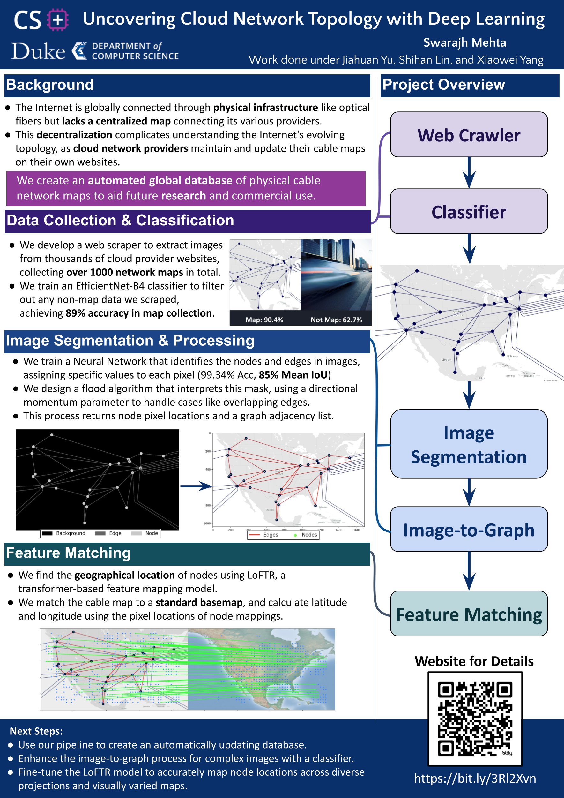

# Swarajh CS+ Research Work

This repository contains a portion of the work I did during my CS+ research program. While much of the full project is distributed across different lab servers, I’m in the process of organizing and uploading a complete, standalone version here.

For now, this repo includes:
- The core image segmentation pipeline (`segmentation_pipeline.py` is a good start)
- A feature matching module

### A detailed breakdown of my work can be found here: [Project Website](https://quilt-sponge-162.notion.site/Swarajh-Summer-24-Research-1c94e26ae7be8066a8f5c738e3566001?pvs=4)

---

